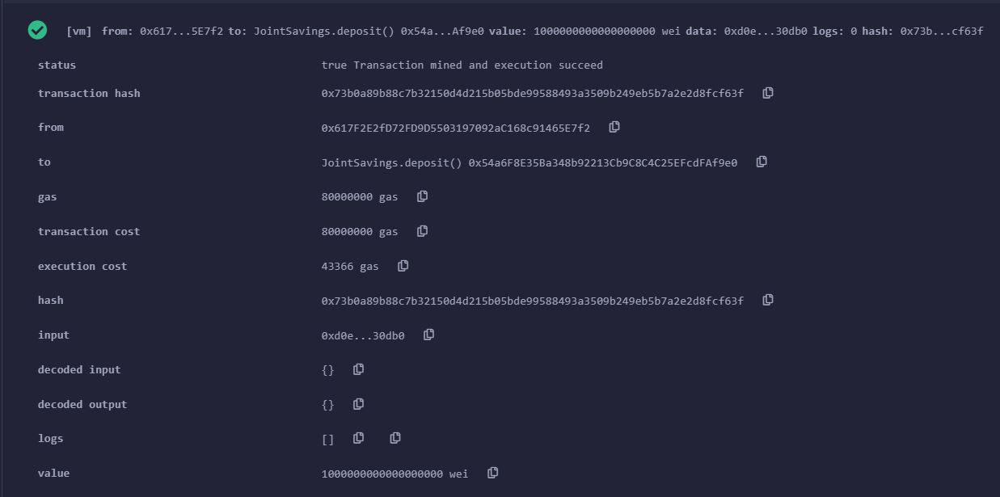
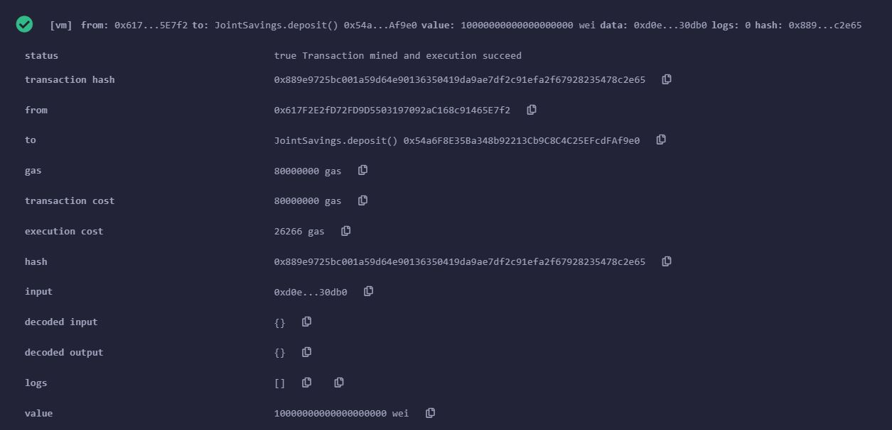
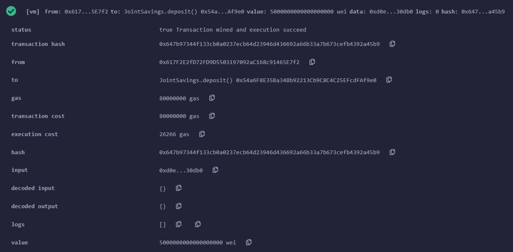
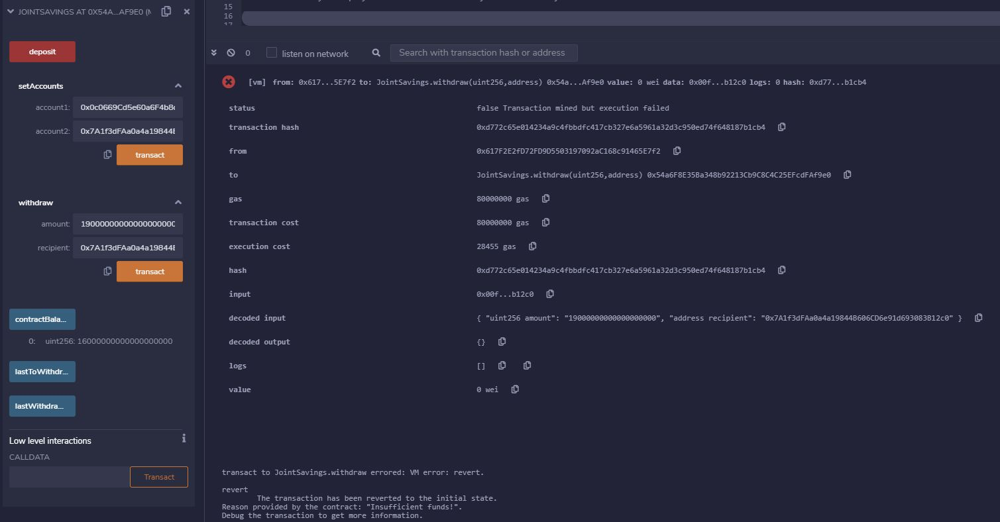
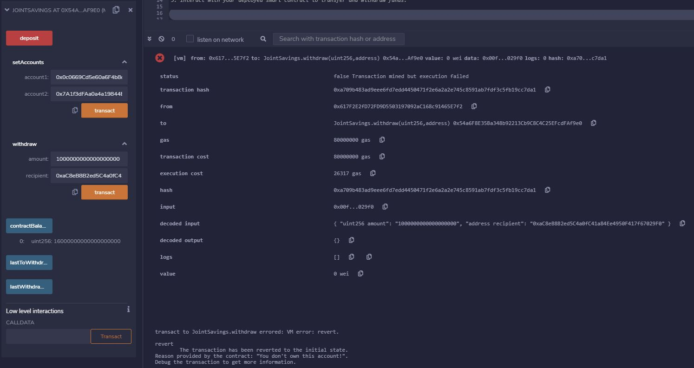
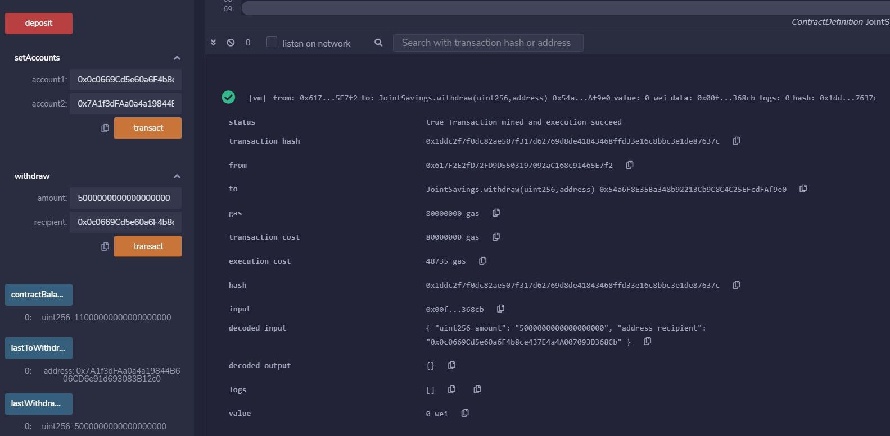
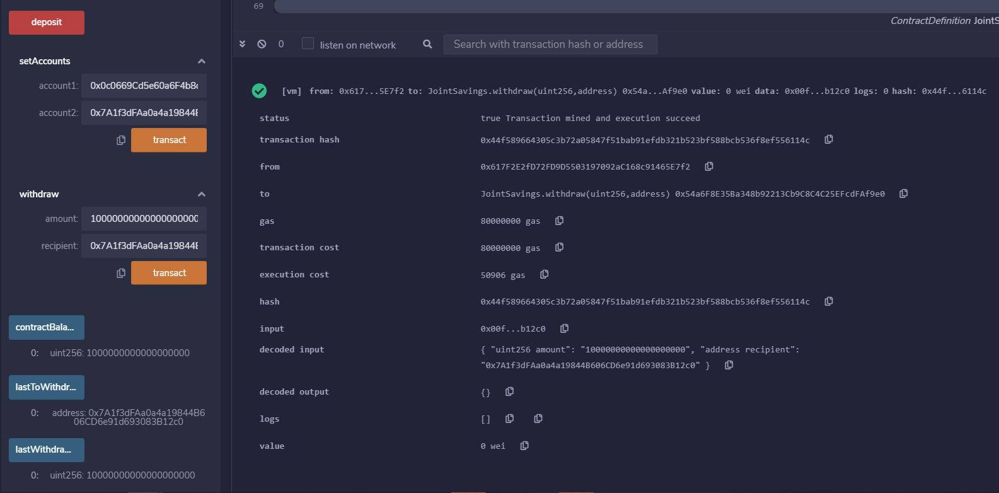
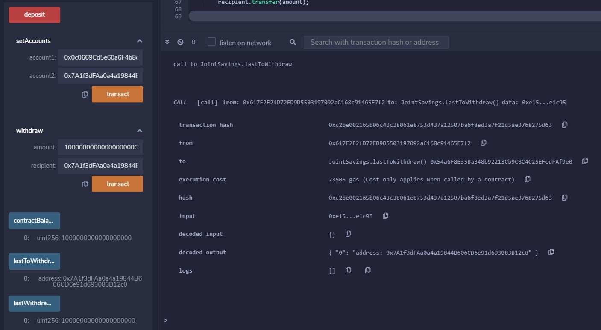
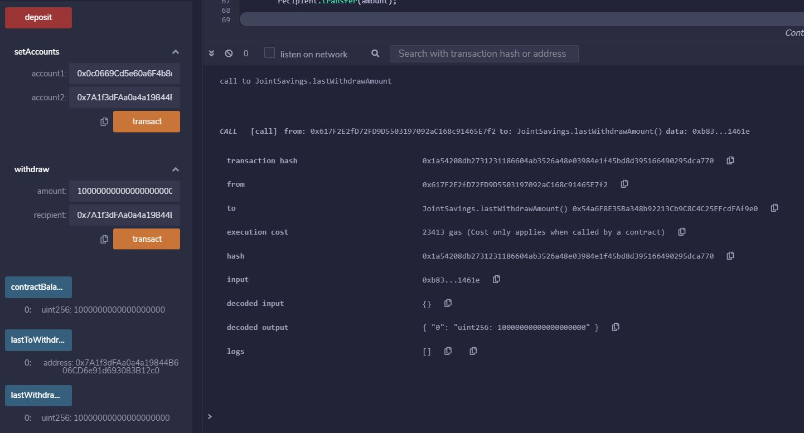

# Fin-Tech_Challenge_20_Smart_Contracts_with_Solidity

A fintech startup company has recently hired you. This company is disrupting the finance industry with its own cross-border, Ethereum-compatible blockchain that connects financial institutions. Currently, the team is building smart contracts to automate many of the institutions’ financial processes and features, such as hosting joint savings accounts.

To automate the creation of joint savings accounts, you’ll create a Solidity smart contract that accepts two user addresses. These addresses will be able to control a joint savings account. Your smart contract will use ether management functions to implement a financial institution’s requirements for providing the features of the joint savings account. These features will consist of the ability to deposit and withdraw funds from the account.

## Overview

#### 1. Deposit

##### 1.1. Send 1 ether as wei to the contract

##### 1.2. Send 10 ether as wei to the contract

##### 1.3. Send 5 ether as wei to the contract

#### 2. Transaction

##### 2.1 failed transaction: insufficient amount

##### 2.2. failed transaction: invalid account

##### 2.3. transfer 5 ether to account1

##### 2.4. transfer 10 ether to account2

### 3. Getter

##### 3.1. call the method lastToWithdraw

##### 3.2. Call the method lastWithdrawAmount

## Technologies

* [Solidity](https://docs.soliditylang.org/en/v0.8.7/) - Solidity is an object-oriented, high-level language for implementing smart contracts. Smart contracts are programs which govern the behaviour of accounts within the Ethereum state.
* [Remix IDE](https://remix-ide.readthedocs.io/en/latest/) - Remix IDE is an open source web and desktop application. It fosters a fast development cycle and has a rich set of plugins with intuitive GUIs. Remix is used for the entire journey of contract development as well as being a playground for learning and teaching Ethereum.

## Installation Guide

Since web version of Remix IDE is provided, installation is not needed.

## Usage
